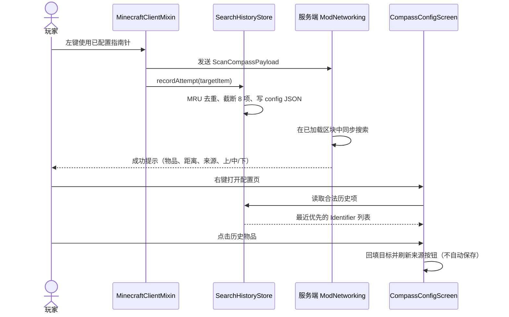

# 指南针扩大范围与搜索历史技术方案

## 1. 需求类型

**全栈需求**：客户端新增搜索历史持久化与配置页交互；共享/服务端扩大合法半径并补充成功方向反馈；另行产出官方 API 性能调研文档。本轮不重写 `BlockScanner`、`ContainerScanner`、`DroppedItemScanner` 或 `CompassSearchService`。

## 2. 方案概述

将共享半径上限提升到 256；客户端在扫描 Payload 成功发送后把目标 Identifier 写入最近 8 项的实例级 JSON，并在配置页以横向物品图标回填目标；服务端使用命中原始 Y 与玩家 Y 的差值生成“上 / 中 / 下”；扫描架构优化仅形成官方 API 调研结论。

### 2.1 操作链路



## 3. 改动范围

| 端 | 文件 | 改动类型 | 目的 |
|---|---|---|---|
| 共享/服务端 | `src/main/java/dev/christine/compassenhanced/component/CompassConfigComponent.java` | 修改 | 将唯一半径上限从 128 提升到 256 |
| 客户端 | `src/client/java/dev/christine/compassenhanced/client/history/SearchHistoryStore.java` | 新增 | 加载、校验、MRU 去重并持久化最近 8 个目标 Identifier |
| 客户端 | `src/client/java/dev/christine/compassenhanced/client/mixin/MinecraftClientMixin.java` | 修改 | 发送扫描请求后记录“已尝试搜索”目标 |
| 客户端 | `src/client/java/dev/christine/compassenhanced/client/screen/SearchHistoryWidget.java` | 新增 | 横向绘制最多 8 个物品图标，提供悬浮提示和点击回调 |
| 客户端 | `src/client/java/dev/christine/compassenhanced/client/screen/CompassConfigScreen.java` | 修改 | 加入历史行、点击回填并重排紧凑布局 |
| 服务端 | `src/main/java/dev/christine/compassenhanced/network/ModNetworking.java` | 修改 | 用原始命中 Y 计算方向并追加成功消息参数 |
| 共享资源 | `src/main/resources/assets/compass_enhanced/lang/zh_cn.json` | 修改 | 增加历史与方向中文文案 |
| 共享资源 | `src/main/resources/assets/compass_enhanced/lang/en_us.json` | 修改 | 增加历史与方向英文文案 |
| 文档 | `docs/2026-08-21-扩大范围与搜索历史/search-performance-research.md` | 新增 | 记录官方 API 证据、复杂度与后续优化路线 |

## 4. 改动详情

### 4.1 共享半径上限

**文件**：`src/main/java/dev/christine/compassenhanced/component/CompassConfigComponent.java`

**位置**：`CompassConfigComponent` 的范围常量区，`DEFAULT_RADIUS` 之后。

改动前：

```java
public static final int MIN_RADIUS = 8;
public static final int DEFAULT_RADIUS = 32;
public static final int MAX_RADIUS = 128;
```

改动后：

```java
public static final int MIN_RADIUS = 8;
public static final int DEFAULT_RADIUS = 32;
public static final int MAX_RADIUS = 256;
```

该常量继续作为唯一真实源，直接覆盖 `Codec.intRange`、`RadiusSlider` 映射、`handleSave` 校验和 `handleScan` 的 `isValid` 校验。`VAR_INT` 编码不变。

### 4.2 客户端历史存储

**文件**：`src/client/java/dev/christine/compassenhanced/client/history/SearchHistoryStore.java`

**位置**：在新建的 `client.history` 包中新增完整类；此前无历史存储文件。

新增后的核心结构：

```java
package dev.christine.compassenhanced.client.history;

public final class SearchHistoryStore {
    private static final int FILE_VERSION = 1;
    private static final int MAX_ENTRIES = 8;
    private static final Path FILE = FabricLoader.getInstance()
            .getConfigDir()
            .resolve("compass_enhanced-search-history.json");
    private static final SearchHistoryStore INSTANCE = new SearchHistoryStore();

    private final List<Identifier> entries = new ArrayList<>();

    public static SearchHistoryStore getInstance() {
        return INSTANCE;
    }

    public List<Identifier> entries() {
        return List.copyOf(entries);
    }

    public void recordAttempt(Identifier itemId) {
        if (!isValidItem(itemId)) {
            return;
        }
        entries.remove(itemId);
        entries.addFirst(itemId);
        if (entries.size() > MAX_ENTRIES) {
            entries.subList(MAX_ENTRIES, entries.size()).clear();
        }
        save();
    }
}
```

实现约束：

- 构造时读取 `config/compass_enhanced-search-history.json`；根对象必须为版本 `1` 且包含字符串数组 `items`。
- 每个字符串用 `Identifier.tryParse` 解析，并通过 `Registries.ITEM.containsId` 且物品不为 `Items.AIR`；无效项直接过滤。
- 加载时再次按出现顺序去重并截断到 8 项，保证外部编辑文件也不会破坏边界。
- `recordAttempt` 将目标移到索引 0，保存不可变快照语义的最近优先列表。
- 使用 Gson 输出 UTF-8 JSON；先写同目录临时文件，再通过 `Files.move(..., REPLACE_EXISTING)` 替换目标文件。读取或写入失败只记录日志并保持游戏运行；不得清空一个已成功加载的内存列表。
- 历史文件位于 Minecraft 实例配置目录，因此跨服务器、跨存档共享，不与指南针 ItemStack 数据同步。

### 4.3 在实际发包入口记录历史

**文件**：`src/client/java/dev/christine/compassenhanced/client/mixin/MinecraftClientMixin.java`

**位置**：`compassEnhanced$scanConfiguredCompass` 中，主手物品校验通过后；将当前 `contains` 判断改为取出配置对象，并在 `ClientPlayNetworking.send` 之后写历史。

改动前：

```java
if (!mainHandStack.isOf(Items.COMPASS)
        || !mainHandStack.contains(ModComponents.COMPASS_CONFIG)) {
    return;
}

ClientPlayNetworking.send(ScanCompassPayload.INSTANCE);
cir.setReturnValue(false);
```

改动后：

```java
if (!mainHandStack.isOf(Items.COMPASS)) {
    return;
}

CompassConfigComponent config = mainHandStack.get(ModComponents.COMPASS_CONFIG);
if (config == null) {
    return;
}

ClientPlayNetworking.send(ScanCompassPayload.INSTANCE);
SearchHistoryStore.getInstance().recordAttempt(config.targetItem());
cir.setReturnValue(false);
```

记录点严格位于发送之后：只选择目标或保存配置不记录。现有 C2S 协议无 S2C 执行确认，因此本字段的准确含义是“客户端最近已尝试搜索”，包含被服务端冷却或校验拒绝的请求。

### 4.4 横向历史组件与配置页回填

**文件一**：`src/client/java/dev/christine/compassenhanced/client/screen/SearchHistoryWidget.java`

**位置**：与 `ItemGridWidget` 同包新增包级 `final` 控件；此前无历史控件。

新增后的职责：

```java
final class SearchHistoryWidget extends ClickableWidget {
    private static final int CELL_SIZE = 24;
    private final List<Identifier> itemIds;
    private final Consumer<Identifier> onSelected;

    // renderWidget: 从左到右绘制最多 8 个 ItemStack 图标；当前目标使用选中色背景；
    // 鼠标悬浮时展示本地化物品名和完整 Identifier。
    // mouseClicked: 仅响应左键且命中有效 cell，播放点击音并调用 onSelected。
    // appendClickableNarrations: 使用 history_narration 翻译键报告历史数量。
}
```

空列表仍绘制一条 24px 高的占位区域，并显示 `screen.compass_enhanced.config.history.empty`。控件只接收 `SearchHistoryStore.entries()` 已校验快照，不自行读写磁盘。

**文件二**：`src/client/java/dev/christine/compassenhanced/client/screen/CompassConfigScreen.java`

**位置 A**：类常量和 Widget 字段区，加入统一面板高度及历史控件字段。

改动前：

```java
private static final int PANEL_WIDTH = 300;

private ButtonWidget targetButton;
private ButtonWidget blocksButton;
```

改动后：

```java
private static final int PANEL_WIDTH = 300;
private static final int PANEL_HEIGHT = 214;

private ButtonWidget targetButton;
private SearchHistoryWidget historyWidget;
private ButtonWidget blocksButton;
```

**位置 B**：`init()` 中 `targetButton` 之后、`RadiusSlider` 之前插入历史控件，并将来源按钮改成两列加一整行。`render()` 必须复用相同偏移常量，避免绘制文本和可点击区域错位。

改动前：

```java
int top = Math.max(8, (height - 210) / 2);

targetButton = addDrawableChild(ButtonWidget.builder(targetMessage(), button -> openItemSelector())
        .dimensions(left, top + 28, PANEL_WIDTH, 20)
        .build());

addDrawableChild(new RadiusSlider(left, top + 63, PANEL_WIDTH, 20));

blocksButton = addDrawableChild(ButtonWidget.builder(Text.empty(), button -> {
    searchBlocks = !searchBlocks;
    refreshSourceButtons();
}).dimensions(left, top + 98, PANEL_WIDTH, 20).build());
```

改动后：

```java
int top = Math.max(8, (height - PANEL_HEIGHT) / 2);

targetButton = addDrawableChild(ButtonWidget.builder(targetMessage(), button -> openItemSelector())
        .dimensions(left, top + 24, PANEL_WIDTH, 20)
        .build());

historyWidget = addDrawableChild(new SearchHistoryWidget(
        left,
        top + 59,
        PANEL_WIDTH,
        24,
        SearchHistoryStore.getInstance().entries(),
        targetItemId,
        this::selectTarget
));

addDrawableChild(new RadiusSlider(left, top + 98, PANEL_WIDTH, 20));

blocksButton = addDrawableChild(ButtonWidget.builder(Text.empty(), button -> {
    searchBlocks = !searchBlocks;
    refreshSourceButtons();
}).dimensions(left, top + 133, 146, 20).build());
```

完整布局使用固定偏移：标题 `0`；目标标签/按钮 `14/24`；历史标签/行 `48/59`；范围标签/滑块 `87/98`；来源标签 `122`；方块与掉落物按钮同排 `133`；容器按钮整排 `157`；警告 `181`；取消/保存 `193`。在 240px 高窗口中 `top=13`、底部为 226，不越界。

`selectTarget(Identifier)` 保持已有业务入口：历史点击仅设置 `targetItemId`；非 `BlockItem` 时关闭 `searchBlocks`；随后调用 `refreshSourceButtons()`，让目标按钮、来源状态和保存按钮立即刷新。不得调用 `save()` 或关闭页面。

### 4.5 成功提示增加垂直方向

**文件**：`src/main/java/dev/christine/compassenhanced/network/ModNetworking.java`

**位置**：`handleScan` 的 `SearchResult nearest = result.get()` 之后、`BlockPos.ofFloored` 之前计算方向；在成功 `Text.translatable` 的参数尾部传入方向翻译文本。

改动前：

```java
SearchResult nearest = result.get();
BlockPos targetPos = BlockPos.ofFloored(nearest.target());
compass.set(
        DataComponentTypes.LODESTONE_TRACKER,
        new LodestoneTrackerComponent(
                Optional.of(GlobalPos.create(player.getServerWorld().getRegistryKey(), targetPos)),
                false
        )
);
player.sendMessage(
        Text.translatable(
                "message.compass_enhanced.found",
                Text.translatable(targetItem.get().getTranslationKey()),
                Math.round(Math.sqrt(nearest.distanceSquared())),
                Text.translatable(nearest.source().translationKey())
        ),
        true
);
```

改动后：

```java
SearchResult nearest = result.get();
double deltaY = nearest.target().y - player.getY();
String direction = deltaY > 2.0
        ? "up"
        : deltaY < -2.0 ? "down" : "middle";

BlockPos targetPos = BlockPos.ofFloored(nearest.target());
compass.set(
        DataComponentTypes.LODESTONE_TRACKER,
        new LodestoneTrackerComponent(
                Optional.of(GlobalPos.create(player.getServerWorld().getRegistryKey(), targetPos)),
                false
        )
);
player.sendMessage(
        Text.translatable(
                "message.compass_enhanced.found",
                Text.translatable(targetItem.get().getTranslationKey()),
                Math.round(Math.sqrt(nearest.distanceSquared())),
                Text.translatable(nearest.source().translationKey()),
                Text.translatable("message.compass_enhanced.direction." + direction)
        ),
        true
);
```

分类使用未取整的目标坐标：`deltaY > 2` 为上，`deltaY < -2` 为下，`[-2, 2]`（含边界）为中。Lodestone 的 `BlockPos` 取整顺序不变，3D 欧氏距离与来源选择逻辑不变。

### 4.6 中英文资源

**文件**：

- `src/main/resources/assets/compass_enhanced/lang/zh_cn.json`
- `src/main/resources/assets/compass_enhanced/lang/en_us.json`

**位置**：替换现有 `message.compass_enhanced.found` 值，并在成功消息附近新增三个方向键；在配置页 target 文案附近新增历史键。

改动前（中文）：

```json
"message.compass_enhanced.found": "🔍 已找到 %1$s · %2$s 格 · %3$s",
"screen.compass_enhanced.config.target": "目标物品"
```

改动后（中文）：

```json
"message.compass_enhanced.found": "🔍 已找到 %1$s · %2$s 格 · %3$s · %4$s",
"message.compass_enhanced.direction.up": "上",
"message.compass_enhanced.direction.middle": "中",
"message.compass_enhanced.direction.down": "下",
"screen.compass_enhanced.config.target": "目标物品",
"screen.compass_enhanced.config.history": "最近搜索",
"screen.compass_enhanced.config.history.empty": "暂无搜索历史",
"screen.compass_enhanced.config.history_narration": "最近搜索，共 %s 项"
```

英文使用对应值 `Up`、`Level`、`Down`、`Recent searches`、`No search history` 和 `Recent searches with %s items`，成功模板同样追加 `%4$s`。

### 4.7 官方 API 性能调研文档

**文件**：`docs/2026-08-21-扩大范围与搜索历史/search-performance-research.md`

**位置**：需求文档目录新增独立文档；不改扫描器源码。

文档必须固定到 Minecraft `1.21.4`、Yarn `1.21.4+build.8`、Fabric API `0.119.4+1.21.4`，并包含：

1. 当前三个 Scanner 的官方 Yarn/Fabric API 直接链接与线程/加载语义证据，包括 `WorldChunk#getSectionArray`、`ChunkSection#hasAny`、实体范围查询及只获取已加载区块的调用链。
2. 半径 128 与 256 的区块列、section 和最坏方块状态访问数量级对比，并注明估算前提。
3. 近到远 section 排序与当前最近距离剪枝、跨 tick 固定预算可取消任务、增量索引三层路线的收益、代价和适用条件。
4. 明确结论：本轮保留同步 loaded-only 扫描；发布时不得宣称 256 格覆盖未加载区块或对所有目标无主线程成本。

## 5. 接口契约

### 5.1 网络契约

| 接口 | 入参 | 出参 | 本次变化 |
|---|---|---|---|
| `SaveCompassConfigPayload` | `Identifier targetItem`、`int radius`、三个来源布尔值 | 无 | 字段与编码不变；`radius` 合法上限变为 256 |
| `ScanCompassPayload` | 空载荷 | 无 | 不变；客户端发送后本地记录尝试历史 |
| 成功 ActionBar | 翻译键参数 | 客户端本地化文本 | `message.compass_enhanced.found` 从 3 个参数扩展为 4 个，第 4 个是方向 `Text` |

客户端历史不进入 C2S/S2C Payload，服务端不读取或保存该数据。

### 5.2 本地文件契约

路径：`<minecraft-config-dir>/compass_enhanced-search-history.json`

```json
{
  "version": 1,
  "items": [
    "minecraft:diamond_ore",
    "minecraft:chest"
  ]
}
```

约束：`items` 最近优先、去重、最多 8 项；仅接受当前客户端物品注册表中的非空气 Identifier。未知版本、语法错误或字段类型错误按空历史启动且不阻止客户端进入世界。

### 5.3 UI 回调契约

`SearchHistoryWidget -> Consumer<Identifier> -> CompassConfigScreen.selectTarget`。回调只修改当前表单状态，不发保存包、不发扫描包、不关闭页面。

## 6. 需求完整度审计

**完整度：100%（5/5 功能预期均有完整实现路径，无需求降级）**

| ID | PRD 功能预期 | 实现路径 | 完整满足？ | 验收标准 |
|---|---|---|---|---|
| R-01 | 最大探测范围提升到 256 | 修改共享 `MAX_RADIUS`，由 Codec、滑块和服务端双重校验共同引用 | 是 | AC-001、AC-002 |
| R-02 | 持久化最近 8 个实际触发搜索的目标 | 发包后调用 `SearchHistoryStore.recordAttempt`，MRU 去重、截断并写 config JSON | 是 | AC-003～AC-006 |
| R-03 | 配置页横向显示历史并点击回填 | 新增 `SearchHistoryWidget`，回调复用 `selectTarget`，不自动保存 | 是 | AC-007、AC-008 |
| R-04 | 成功提示显示上/中/下 | 服务端对原始目标 Y 与玩家 Y 的差按严格阈值分类 | 是 | AC-009～AC-012 |
| R-05 | 调研扩大范围与效率方案 | 新增官方 API 调研文档任务，输出证据、估算和分阶段路线；本轮扫描器不重写 | 是 | AC-013 |

## 7. 验收标准与验证场景

不新增测试代码或测试文件。通过现有 Gradle 编译、资源处理、客户端手工操作、专用服务端手工场景及文档审阅验证。

| AC-ID | 场景 | 验证方式 | 预期结果 |
|---|---|---|---|
| AC-001 | 配置最大范围 | 打开配置页把滑块拖到最右并保存 | 显示并保存 256，服务端接受配置 |
| AC-002 | 越界配置 | 用现有协议调试方式提交 257 | 服务端提示配置无效；指南针不写入 257 |
| AC-003 | 仅选择或保存目标 | 选择新物品并保存，但不左键扫描；重开页面 | 历史中不出现该目标 |
| AC-004 | 实际发送扫描 | 用已配置指南针左键一次；重开配置页 | 该目标位于历史首项，无论搜索是否命中 |
| AC-005 | MRU 去重与容量 | 按顺序搜索 9 个不同目标，再重复搜索第 3 个 | 仅保留 8 项；重复目标只有一项并移动到首位 |
| AC-006 | 跨重启与坏数据 | 重启客户端后查看；再注入非法 ID、空气和重复项后重启 | 合法项保留；非法项被过滤；页面与游戏不崩溃 |
| AC-007 | 历史横向展示 | 在 240px 高窗口打开含 8 项历史的配置页并逐项悬浮 | 8 个图标横向可见，提示含物品名和 Identifier，底部按钮不越界 |
| AC-008 | 点击历史回填 | 点击一个非 `BlockItem` 历史项 | 目标立即回填，实体方块来源关闭，页面保持打开且未发送保存包 |
| AC-009 | 上方方向 | 让最近命中的原始 `target.y - player.y` 为 `2.01` | 成功提示第 4 段为“上” |
| AC-010 | 中间上边界 | 差值为 `2.00` | 成功提示第 4 段为“中” |
| AC-011 | 中间下边界 | 差值为 `-2.00` | 成功提示第 4 段为“中” |
| AC-012 | 下方方向 | 差值为 `-2.01` | 成功提示第 4 段为“下” |
| AC-013 | 性能调研交付 | 审阅 `search-performance-research.md` 的链接、版本、估算和结论 | 每个 API 结论有官方来源；包含三层路线；明确本轮未重写扫描器 |
| AC-014 | 回归验证 | 执行 `./gradlew compileJava compileClientJava processResources`，再验证普通指南针与三种来源 | 编译/资源处理通过；普通指南针行为不变；搜索仍只访问已加载区块且不读取玩家 Inventory |

## 8. 风险评估

| 风险 | 影响 | 缓解措施 |
|---|---|---|
| 256 格同步扫描对常见方块产生高主线程成本 | 单次服务端 tick 延迟升高 | 保持 10 tick 冷却和 loaded-only；调研文档量化成本并给出后续分片路线；本轮不扩大来源或主动加载区块 |
| “已尝试搜索”不等于“服务端已执行搜索” | 冷却或非法配置请求也进入历史 | UI 与文档统一使用“最近搜索/已尝试”语义；不声称历史代表成功命中 |
| 历史 JSON 被手工破坏或含已移除 Mod 物品 | 配置页加载失败或出现无效图标 | 解析、版本、注册表和空气过滤；失败保持客户端可运行 |
| 紧凑布局在低高度或长英文下拥挤 | 控件重叠或按钮文本截断 | 使用 214px 统一面板高度、来源两列加整行布局，并以 240px 高窗口验收 |
| 方向在阈值处被坐标取整改变 | ±2 附近分类错误 | 必须先使用 `SearchResult.target()` 原始 double Y 分类，再创建 Lodestone `BlockPos` |

## 9. 待确认项

无。需求语义、文件落点、网络边界、历史记录时机、方向阈值和本轮性能优化边界均已确定。

## 10. 后续变更：实施短期搜索优化

> 本章是用户在首轮交付后明确追加的 R-06，覆盖前文“仅调研、不改 Scanner”的历史边界。

### 10.1 改动范围

| 文件 | 改动 |
|---|---|
| `search/LoadedChunkAccess.java` | 一次收集范围内已加载 FULL 区块，计算水平包围盒最小距离并升序排列 |
| `search/CompassSearchService.java` | 按掉落物→容器→方块执行，传递当前 best 平方距离 |
| `search/ContainerScanner.java` | 复用有序区块；读 Inventory 前先做距离与 best 剪枝 |
| `search/BlockScanner.java` | 复用有序区块；候选 Section 按三维包围盒下界升序处理 |
| `search-performance-research.md` | 将短期路线标记为已实施，保留跨 tick 与索引为后续路线 |

### 10.2 内部契约

1. 依然使用 `getChunk(x, z, ChunkStatus.FULL, false)`，不新增 ticket，不生成或主动加载区块；若掉落物已提供 best，先用 chunk 坐标计算水平下界，不可能严格更近的区块不调用 `getChunk`。
2. 方块与容器在一次搜索中复用同一份不可变有序区块列表。
3. 剪枝阈值为 `min(radiusSquared, bestDistanceSquared)`；仅当候选包围盒的最小可能平方距离不小于阈值时跳过。
4. 容器的准确中心距离在槽位扫描之前计算；方块 Section 保留 `isEmpty` 和 palette `hasAny` 快速否决。
5. 公开方法 `CompassSearchService.search(...)` 的入参、返回类型与精确最近语义不变；同距离时保留先发现结果。

### 10.3 需求与验收

| ID | 需求 | 完整满足 | 验收 |
|---|---|---|---|
| R-06 | 实施短期搜索优化 | 是 | AC-015～AC-017 |
| AC-015 | 精确性不变 | 是 | 仅剪掉数学下界不小于 best 的候选，所有命中仍做 3D 半径与严格更近判断 |
| AC-016 | 已加载区块复用 | 是 | 容器与方块使用同一列表，并保留 `FULL, false` |
| AC-017 | 构建回归 | 是 | `clean build --offline` 通过，无测试文件与无关改动 |

### 10.4 风险

- 近到远与 best 剪枝在“近处存在目标”时收益最大；目标不存在时仍会接近全扫描。
- 本次仍是服务器主线程同步搜索；如真实压测的单 tick 预算仍不可接受，下一步必须是跨 tick 分片，而不是将世界读取直接放到普通异步线程。
